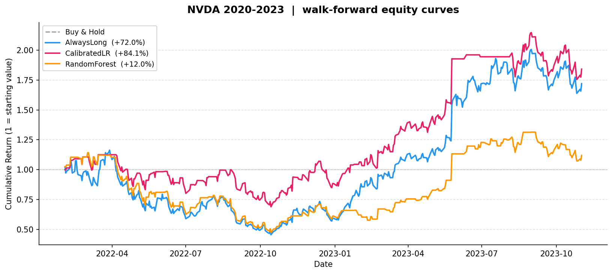

# tsml — Financial Time Series ML Pipeline

A modular, leakage-safe machine learning pipeline for financial time series,
built to demonstrate rigorous evaluation discipline for financial time series,
rather than to claim any predictive edge.

---

## What this project is

`tsml` is a learning and research framework for applying supervised ML to daily
equity data.  It is structured around the practices that separate serious
quantitative work from naive experimentation:

- time-series-aware cross-validation (walk-forward)
- strict separation of feature fitting and model fitting from test data
- realistic backtesting with transaction costs
- comparison against simple baselines before drawing any conclusions

The pipeline runs end-to-end from raw OHLCV data to financial performance
metrics.  Every design choice is documented so the code can be understood,
extended, and critiqued.

The primary goal is to build a correct and reproducible experimental framework,
not to maximise backtest performance.

## What this project is not

- It is **not** a trading system.  No live trading, no order management, no
  position sizing beyond flat/long.
- It is **not** a claim that machine learning can reliably predict market
  direction.  The results show the opposite is more often true.
- It is **not** overfitted to a single asset or period.  Results are reported
  across four symbols and three date ranges.

---

## Pipeline overview

```
Raw OHLCV data (Yahoo Finance)
        │
        ▼
  data_loader/          Download, cache as Parquet, validate columns
        │
        ▼
  features/             Technical features (returns, RSI, SMA ratio, volatility)
                        Targets built with a forward shift — no lookahead
        │
        ▼
  validation/           WalkForwardSplit — expanding window, configurable folds
        │
        ▼
  models/               Fit on each train fold, predict on each test fold
                        AlwaysLong · PreviousDirection · LogisticRegression
                        CalibratedLogisticRegression · RandomForest
        │
        ▼
  backtest/             Position = prediction shifted by 1 day (signals at t executed at t+1)
                        Transaction costs in basis points applied on each trade
        │
        ▼
  metrics/              ML: accuracy, precision, recall
  pipelines/evaluate    Financial: Sharpe, CAGR, max drawdown, turnover
        │
        ▼
  reporting/            Equity curve plots saved to reports/
```

### Module map

| Module | Responsibility |
|---|---|
| `data_loader/` | Download OHLCV via `yfinance`, cache as Parquet, validate schema |
| `features/transformers.py` | Stateless feature functions (returns, RSI, SMA ratio, volatility) |
| `features/pipeline.py` | `build_features` → `make_dataset` (features + forward-shifted target) |
| `validation/splitters.py` | `WalkForwardSplit`: expanding-window, configurable gap/embargo |
| `models/baselines.py` | `AlwaysLong`, `PreviousDirection`, `LogisticRegressionModel`, `CalibratedLogisticRegressionModel`, `RandomForestModel` |
| `pipelines/train.py` | `run_walk_forward` (hard labels) · `run_walk_forward_proba` (P(up)) |
| `pipelines/evaluate.py` | `evaluate`: wraps ML + financial metrics in one call |
| `backtest/engine.py` | `run_backtest`: vectorised, cost-aware, no-lookahead |
| `metrics/ml.py` | Accuracy, precision, recall, classification report |
| `metrics/returns.py` | Sharpe, CAGR, max drawdown, hit rate, turnover |
| `reporting/plots.py` | `plot_equity_curves`: multi-strategy PNG output |
| `config.py` | `Config` / `DataConfig` loaded from YAML |

---

## Why walk-forward validation

Standard k-fold cross-validation shuffles data randomly.  For time series this
is a form of data leakage: a model trained on future data and tested on the past
will produce optimistic accuracy estimates that do not hold live.

Walk-forward validation respects the direction of time.  In each fold the
training window ends strictly before the test window begins.  An optional
*gap* (embargo) can be inserted between them to prevent labels near the
fold boundary — which may be partially observed — from contaminating the
training set.

```
Fold 1:  [====== train ======]  gap  [== test ==]
Fold 2:  [========= train =========]  gap  [== test ==]
Fold 3:  [============ train ============]  gap  [== test ==]
                                                   ▲
                                         only this region
                                         is ever evaluated
```

The result is a realistic simulation of sequential deployment: the model only
ever sees data that would have been available at prediction time.

---

## How leakage is avoided

Five explicit rules are enforced throughout the codebase:

| Rule | Where it is enforced |
|---|---|
| Features use only data up to and including time *t* | `features/transformers.py` — no forward-looking windows |
| Target is `close[t+1] > close[t]` — a strict forward shift | `features/targets.py → next_day_direction` |
| Scalers are fitted on the training fold only | `LogisticRegressionModel.fit` — `StandardScaler.fit_transform(X_train)` |
| Calibration uses only training-fold data | `CalibratedLogisticRegressionModel.fit` — `CalibratedClassifierCV` fitted on `X_train` |
| Positions are executed one day after the prediction | `backtest/engine.py` — `position[t] = prediction[t-1]` |

The backtest position shift is the most commonly overlooked point in
amateur implementations.  A prediction made at the close of day *t* cannot
influence a position until the open of day *t+1*.

---

## Why baselines matter

A model that cannot beat a trivially simple baseline is not useful, regardless
of its accuracy score.  Three baselines are provided:

| Baseline | Logic | What it encodes |
|---|---|---|
| `AlwaysLong` | Predict 1 every day | Long-run upward drift of equity markets |
| `PreviousDirection` | Repeat yesterday's direction | Simple momentum hypothesis |
| Buy-and-hold | Hold continuously (no model) | Passive benchmark in the backtest |

Any trained model should be judged relative to these.  A model with higher
accuracy than `AlwaysLong` but lower Sharpe is still losing to the baseline
on the metric that matters most for portfolio allocation.

---

## Summary of findings

The demo (`demo.py`) runs three models across four symbols (SPY, QQQ, MSFT,
NVDA) and three date ranges (2015–2023, 2020–2023, 2022–2023).  Key
observations:

**AlwaysLong is the hardest baseline to beat on Sharpe.**  For index ETFs
(SPY, QQQ) over a long horizon, the upward drift dominates and no model
consistently improves on it risk-adjusted.

**CalibratedLogisticRegression is the best single model on average.**
Probability calibration (Platt scaling) tightens the probability scores and
reduces unnecessary trades.  On NVDA 2020–2023 it achieved Sharpe 1.11 vs
0.79 for buy-and-hold by reducing drawdown exposure during the 2022 selloff.

**RandomForest can produce strong results in specific high-trend periods, but
these are not consistent across assets or regimes and come at significantly
higher turnover.**  On NVDA 2022–2023 it achieved Sharpe 2.37, but its
30–48 % daily turnover makes it sensitive to transaction cost assumptions.

**Raising the probability threshold does not improve results.**  For all
models, sweeping the signal threshold from 0.50 to 0.65 consistently
degraded Sharpe.  This indicates that probability scores are not sharply
calibrated enough to identify a high-confidence subset — the signal is
distributed across the full range, not concentrated at the tails.

**Short periods are noisy.**  The 2022–2023 window (≈ 500 rows, 3 folds)
produces volatile estimates.  Any single result from a short window should
be treated with caution.

---

## Experiment summary

The experiment was extended to compare three target and holding-period
configurations across five symbols (SPY, QQQ, MSFT, NVDA, GOOGL) and three
date ranges, producing 15 symbol/period groups.

**Configurations tested:**

| Config | Target | Holding period | Description |
|---|---|---|---|
| `dir/hp1` | `direction` | 1 day | Next-day binary direction, hold 1 day |
| `5d/hp5` | `direction_5d` | 5 days | 5-day forward direction, hold 5 days |
| `thr/hp1` | `threshold` | 1 day | High-conviction days only (\|return\| > 0.5%), hold 1 day |

**Headline result:**

Across 15 symbol/period groups, a trained model beat AlwaysLong on Sharpe in
**10 of 15 groups**.  AlwaysLong remained the best strategy in the remaining 5
groups — all of which were long-trend periods where passive market drift
dominates any active signal.

**The threshold target was the strongest configuration overall**, winning in 7
of the 10 trained-model wins.  Training exclusively on high-conviction days
— where the next-day return exceeds 0.5 % in magnitude — appears to produce a
cleaner decision boundary than training on every daily observation.  Neutral,
low-signal days add label noise without contributing predictive value.

**CalibratedLogisticRegression tended to win in stable trend regimes** (e.g.
MSFT 2015–2023: Sharpe 1.87, total return +227%).  Platt scaling reduces
unnecessary trades, and the model is well-suited to periods where the signal
is persistent and costs compound quickly.

**RandomForest tended to win in volatile and high-momentum regimes** (e.g.
QQQ 2022–2023: Sharpe 3.20; NVDA 2022–2023: Sharpe 3.00).  However, it
consistently carries higher turnover (30–43% of days), which makes its
advantage sensitive to transaction cost assumptions and unlikely to persist
under realistic execution.

**These results should be interpreted with caution.**  The winning
configurations were identified in hindsight across a limited set of assets and
periods.  Non-stationarity means that a configuration that worked well in
2015–2023 may not hold in the next period.  The findings are evidence that
target design and regime sensitivity matter, not proof of a durable edge.

---

### NVDA 2020–2023 equity curves

Note: The plotted period begins after the initial training window required for walk-forward validation.



CalibratedLR (pink) avoided most of the 2022 drawdown by staying mostly flat
(55 % long days), then participated in the 2023 recovery.  AlwaysLong (blue)
and RandomForest (orange) both rode the full −60 % drawdown before recovering.

---

## Honest limitations

| Limitation | Why it matters |
|---|---|
| Features are simple price-derived indicators | No fundamentals, earnings, macro, or alternative data |
| Binary long/flat only | No short selling, no position sizing, no leverage |
| Single-asset backtests | No portfolio effects, correlation, or diversification |
| No slippage or market impact | Costs are modelled as a flat per-trade bps, not realistic fill costs |
| Walk-forward folds are few | 3–8 folds is not enough to draw statistically significant conclusions |
| Probability calibration is in-sample within each fold | Still subject to non-stationarity across regimes |
| No regime detection | A 2020–2023 model must handle both a pandemic crash and a rate-hike bear market |
| Results are sensitive to the chosen assets and time periods | Financial time series are non-stationary, and performance does not generalise reliably |

---

## Next steps

- Add fundamental or macro features (e.g. VIX, yield curve slope)
- Implement proper position sizing (e.g. Kelly fraction, volatility targeting)
- Extend to multi-asset portfolio backtesting with correlation constraints
- Add statistical significance tests for Sharpe (e.g. deflated Sharpe ratio)
- Implement regime detection to condition model selection
- Replace flat cost model with a bid-ask spread and market-impact model
- Add hyperparameter optimisation inside each training fold

---

Overall, the experiments show that building a correct evaluation framework is
significantly more challenging — and more important — than improving model
complexity.

## Quickstart

```bash
python -m venv .venv
.venv\Scripts\activate          # Windows
# .venv/bin/activate            # macOS / Linux
pip install -e ".[dev]"
pytest
python demo.py
```

Data is downloaded from Yahoo Finance on first run and cached locally as
Parquet files under `data/raw/`.  The `data/` directory is gitignored.
Equity curve plots are saved to `reports/`.

## Project layout

```
src/tsml/
├── backtest/         # vectorised, cost-aware backtest engine
├── data_loader/      # download, cache, validate, split OHLCV data
├── features/         # feature transformers and forward-shifted targets
├── metrics/          # ML classification metrics and financial return metrics
├── models/           # model protocol + five model implementations
├── pipelines/        # walk-forward training loop and evaluate helper
├── reporting/        # equity curve plot output
└── validation/       # WalkForwardSplit (expanding window)
configs/              # example YAML configuration
reports/              # generated equity curve PNGs
tests/                # pytest test suite
demo.py               # end-to-end experiment script
```
